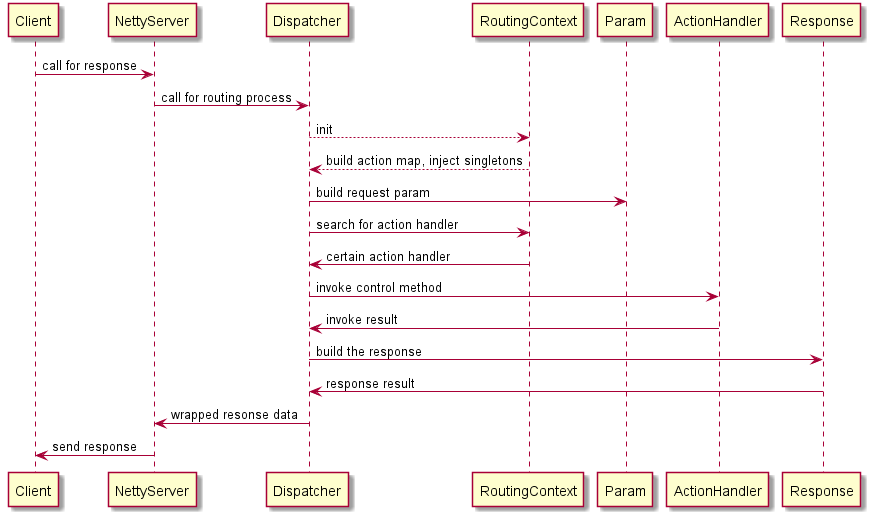

# Http server and mvc framework with netty.

Used 3-rd party libraries:
- Netty
- Fastjson
- Freemarker
- Logback
- Owner
- Apache commons

## Basic workflow:


## Core config:
The `config.properties` need to be provided, `router.basePackage` should be included in this file. Then add the `NettyRequestDispatcher` to your channel pipeline.
 
## Example:
```java
@Router
public class BasicRouter {
    
    @Action(value = "/act", method = {RequestMethod.GET})
    public Response act(RequestParam param) {
        Response response = new JsonResponse();
        response.put("date", new Date());
        response.put("name", "Michael Yan");
        System.out.println("Query params:" + param.getInt("id"));
        return response;
    }
    
    @Action(value = "/post", method = {RequestMethod.POST})
    public Response testPost(RequestParam param) {
        Response response = new JsonResponse();
        response.put("param", param);
        response.put("date", new Date().toString());
        return response;
    }
    
    @Action(value = "/view", method = {RequestMethod.POST})
    public Response testView(RequestParam param) {
        Response response = new HtmlResponse("test");
        response.put("data", "server data");
        response.put("strings", new String[]{"abc", "dfr", "klo"});
//        response.setHtmlContent("<h1>Sample html content.</h1>");
        return response;
    }
    
}
``` 
Now, we only support GET/POST method, response data type will include plain txt/json/html, html template engine: freemarker.